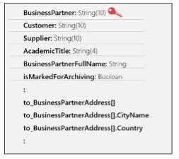
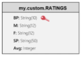
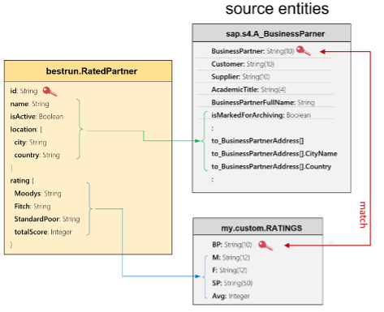

[](https://api.reuse.software/info/github.com/SAP-samples/teched2023-IN267)

# IN267 - Have Fun with SAP Integration Suite: API Management and Graph


## Description

This repository contains the material for the SAP TechEd 2022 session called Session ID - Session Title. 


### Before you start 

This hands-on exercise, designed for TechEd, is performed by multiple participants in parallel, using production tenants with shared resources in two shared SAP Business Technology Platform (BTP) subaccounts. This means: 

 

Use the user that we provide only for this exercise, and not for anything else.  

Strictly follow the instructions, regarding naming conventions of the artefacts you will create.  

Ignore other artefacts, created by other participants, that may appear in your shared account..  

 

The TechEd accounts were pre-configured with all the roles and definitions you need to complete this exercise. 

## Overview

This session introduces attendees to...

### The story 

You are the API Administrator of BestRun. 

 

One of your clients has asked you for an API to access the credit rating of BestRun’s worldwide suppliers. These suppliers are maintained as “Business Partners” in your corporate SAP S/4HANA system, but without credit rating information. Your colleague has written a CAP-based application that extends the SAP S/4HANA partner data with credit ratings.  

 

Your task is to design a secure and easy-to-use API for your client.  

## Requirements

The requirements to follow the exercises in this repository are...

### The custom model extension 

Suppliers are maintained in the SAP S/4HANA system, and accessible via the A_BusinessPartner API.  

 
We don’t want to give our client direct access to this API. Firstly, the credentials are highly confidential, and unauthorized usage might impact our business. Secondly, the A_BusinessPartner entity is very complex with well over a hundred attributes (see illustration), which may overwhelm our client, who only needs the partner address and credit ratings. Thirdly, and most importantly, the credit ratings of the partners are managed in a separate CAP application on BTP.  

 

Our goal is to provide the client with a simplified view of the partners, their location, and their credit ratings, via a single API, using the Graph capability of API Management and further secured by an API proxy.  

 

The simple CAP financials application written by our colleague, has a RATINGS entity that matches the business partner on its key (BP), and looks like this, based on a very simple corresponding CDS entity specification. 

The application is poorly secured by basic authentication and runs on BTP. Again, we do not want to provide direct access to it from our client, with whom we would have to share the user/password to the application. And, the client would have to learn how to make multiple queries to two different applications, and then combine the data, just to get the information they need.  

 
So how do we solve this?  

 

The Graph feature of API Management supports custom extensions, technically entities with views on one or more underlying data sources. We will design such a custom entity.  

This custom entity will combine partner info from the A_BusinessPartner entity in SAP S/4HANA, and the credit ratings from the RATINGS entity in the CAP application. We will call it RatedPartner within the bestrun namespace, shown at the left of the following illustration. 



The easiest way to develop such an extension entity is to use the powerful graphical extension editor. Unfortunately, this editor was not yet available at the time we put this course together in mid-2023, and so, instead, we will define the extension specification as a JSON specification, as seen in the box below.

````
   
{
 "version": "1.0.0",
 "entity": "bestrun.RatedPartner",
 "label": "Rated Partner",

 "sourceEntities": [
     {"name": "my.custom.RATINGS"},
     {"name": "sap.s4.A_BusinessPartner","join": [["BP", "BusinessPartner" ]] }
 ],
 "dicts": { "map": { "excellent": "9", "very good": "8", "good": "7", "acceptable": "6", "at risk": "5" } },

 "attributes": [
   { "name": "id",       "source": [ "BP" ], "key": true },
   { "name": "name",     "source": [ "BusinessPartnerFullName"], "sourceEntity": "sap.s4.A_BusinessPartner", "type": "String" },
   { "name": "isActive", "source": [ "IsMarkedForArchiving"], 
        "sourceEntity": "sap.s4.A_BusinessPartner", "transform": "negation", "annotations": { "readonly": true, "description": "can be used" } },

   { "name": "location[]",         "source": [ "to_BusinessPartnerAddress[]" ],         "sourceEntity": "sap.s4.A_BusinessPartner" },
   { "name": "location[].city",    "source": [ "to_BusinessPartnerAddress[].CityName"], "sourceEntity": "sap.s4.A_BusinessPartner" },
   { "name": "location[].country", "source": [ "to_BusinessPartnerAddress[].Country" ], "sourceEntity": "sap.s4.A_BusinessPartner" },

   { "name": "rating.Moodys",      "source": [ "M" ], "annotations": { "description": "Moody's credit rating" } },
   { "name": "rating.Fitch",       "source": [ "F" ], "annotations": { "description": "Fitch Ratings' score" } },   
   { "name": "rating.StandardPoor","source": [ "SP"], "annotations": { "description": "Standard&Poor's global credit rating" }},
   { "name": "rating.totalScore",  "source": [ "map", "Avg"], "transform": "dict", "type": "String", 
           "annotations": { "description": "consensus credit score" }}
 ]
}    

````

You should be able to understand how this works. We define the new entity bestrun.RatedPartner, and the two source entities it uses. Then, we define a list of attributes and their derivation from corresponding source attributes, using “transform” functions. You can study the detailed specification in the Graph documentation. 

 

This extension specification was already imported, and available as my-ratedpartner. 

## Exercises

Provide the exercise content here directly in README.md using [markdown](https://guides.github.com/features/mastering-markdown/) and linking to the specific exercise pages, below is an example.

- [Getting Started](exercises/ex0/)
- [Exercise 1 - First Exercise Description](exercises/ex1/)
    - [Exercise 1.1 - Exercise 1 Sub Exercise 1 Description](exercises/ex1#exercise-11-sub-exercise-1-description)
    - [Exercise 1.2 - Exercise 1 Sub Exercise 2 Description](exercises/ex1#exercise-12-sub-exercise-2-description)
- [Exercise 2 - Second Exercise Description](exercises/ex2/)
    - [Exercise 2.1 - Exercise 2 Sub Exercise 1 Description](exercises/ex2#exercise-21-sub-exercise-1-description)
    - [Exercise 2.2 - Exercise 2 Sub Exercise 2 Description](exercises/ex2#exercise-22-sub-exercise-2-description)

  
**OR** Link to the Tutorial Navigator for example...

Start the exercises [here](https://developers.sap.com/tutorials/abap-environment-trial-onboarding.html).

**IMPORTANT**

Your repo must contain the .reuse and LICENSES folder and the License section below. DO NOT REMOVE the section or folders/files. Also, remove all unused template assets(images, folders, etc) from the exercises folder. 

## Contributing
Please read the [CONTRIBUTING.md](./CONTRIBUTING.md) to understand the contribution guidelines.

## Code of Conduct
Please read the [SAP Open Source Code of Conduct](https://github.com/SAP-samples/.github/blob/main/CODE_OF_CONDUCT.md).

## How to obtain support

Support for the content in this repository is available during the actual time of the online session for which this content has been designed. Otherwise, you may request support via the [Issues](../../issues) tab.

## License
Copyright (c) 2023 SAP SE or an SAP affiliate company. All rights reserved. This project is licensed under the Apache Software License, version 2.0 except as noted otherwise in the [LICENSE](LICENSES/Apache-2.0.txt) file.
