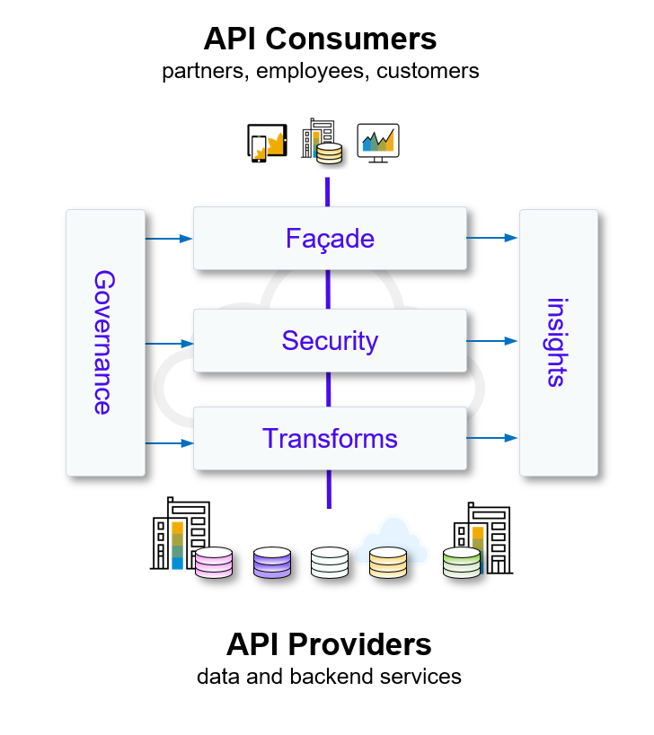

# IN267 - Have Fun with SAP Integration Suite: API Management and Graph

## Description

This repository contains the material for the SAP TechEd 2022 session called Session ID - Session Title. 

Enterprise IT landscapes are becoming increasingly complex, hybrid and multi-vendor. APIs are used to expose a company's data and make enterprise assets available to internal and external business users. As the interfaces of the digital building blocks of composable architectures, APIs:

-   Provide interoperability and data sharing between software systems.
-   Enable the integration and innovation of new products and services.
-   Are critical for creating an ecosystem of 3rd party solutions.
-   Are a source of revenue in the cloud-native economy.

APIs are often exposed to 3rd parties, including business partners and customers. More and more businesses are using APIs to generate new revenue streams, such as through consumption-based pricing or pay-per-use models.

APIs have become **business critical assets**, and as such, *must be carefully managed and secured.*

SAP is aware of the importance of APIs, their security, and management. The API Management capability in SAP Integration Suite is a complete solution that addresses all enterprise requirements for API security and governance. New in 2023 is the ability to create powerful *data graphs*, abstracting an entire landscape with a single API to a connected graph of the data in that landscape.

In this session, we will take a deeper look at SAP’s API Management solution, by building a data graph extension, and protecting this with an API Proxy with the appropriate security policies.

Start the exercises [here](exercise/README.md).

**IMPORTANT**

Your repo must contain the .reuse and LICENSES folder and the License section below. DO NOT REMOVE the section or folders/files. Also, remove all unused template assets(images, folders, etc) from the exercises folder. 

## Contributing
Please read the [CONTRIBUTING.md](./CONTRIBUTING.md) to understand the contribution guidelines.

## Code of Conduct
Please read the [SAP Open Source Code of Conduct](https://github.com/SAP-samples/.github/blob/main/CODE_OF_CONDUCT.md).

## How to obtain support

Support for the content in this repository is available during the actual time of the online session for which this content has been designed. Otherwise, you may request support via the [Issues](../../issues) tab.

## License
Copyright (c) 2023 SAP SE or an SAP affiliate company. All rights reserved. This project is licensed under the Apache Software License, version 2.0 except as noted otherwise in the [LICENSE](LICENSES/Apache-2.0.txt) file.
