# Introduction

## Before you start

This hands-on exercise, designed for TechEd, is performed by multiple participants in parallel, using production tenants with *shared resources* in two shared SAP Business Technology Platform (BTP) subaccounts. This means:

1.  Use the user that we provide only for this exercise, and not for anything else.
2.  Strictly follow the instructions, regarding naming conventions of the artefacts you will create.
3.  Ignore other artefacts, created by other participants, that may appear in your shared account..

The TechEd accounts were pre-configured with all the roles and definitions you need to complete this exercise.

## The story

You are the **API Administrator** of BestRun.

One of your clients has asked you for an API to access the credit rating of BestRun’s worldwide suppliers. These suppliers are maintained as “Business Partners” in your corporate SAP S/4HANA system, but without credit rating information. Your colleague has written a CAP-based application that *extends* the SAP S/4HANA partner data with credit ratings.

Your task is to design a secure and easy-to-use API for your client.

## The custom model extension

Suppliers are maintained in the SAP S/4HANA system, and accessible via the `A_BusinessPartner` API.

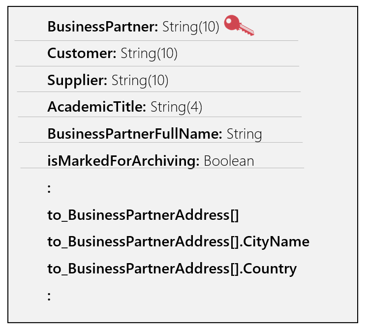 

We don’t want to give our client direct access to this API. Firstly, the credentials are highly confidential, and unauthorized usage might impact our business. Secondly, the `A_BusinessPartner` entity is very complex with well over a hundred attributes (see illustration), which may overwhelm our client, who only needs the partner address and credit ratings. Thirdly, and most importantly, the credit ratings of the partners are managed in a *separate* CAP application on BTP.

Our goal is to provide the client with a simplified view of the partners, their location, and their credit ratings, via a single API, using the Graph capability of API Management and further secured by an API proxy.

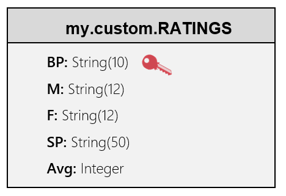

The simple CAP financials application written by our colleague, has a RATINGS entity that matches the business partner on its key (BP), and looks like this, based on a very simple corresponding CDS entity specification.

The application is poorly secured by basic authentication and runs on BTP. Again, we do not want to provide direct access to it from our client, with whom we would have to share the user/password to the application. And, the client would have to learn how to make multiple queries to two different applications, and then combine the data, just to get the information they need.

So how do we solve this?

The Graph feature of API Management supports *custom* *extensions*, technically entities with *views* on one or more underlying data sources. We will design such a custom entity.

This custom entity will combine partner info from the `A_BusinessPartner` entity in SAP S/4HANA, and the credit ratings from the RATINGS entity in the CAP application. We will call it `RatedPartner` within the `bestrun` namespace, shown at the left of the following illustration.

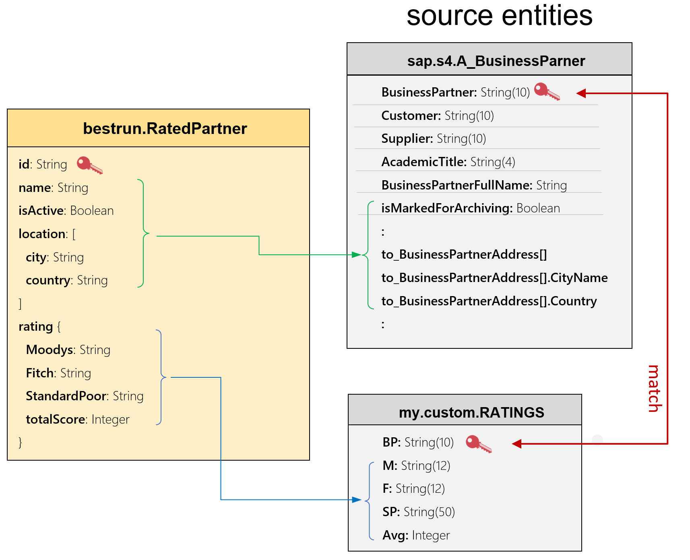

The easiest way to develop such an extension entity is to use the powerful graphical extension editor. Unfortunately, this editor was not yet available at the time we put this course together in mid-2023, and so, instead, we will define the extension specification as a JSON specification, as seen in the box below.

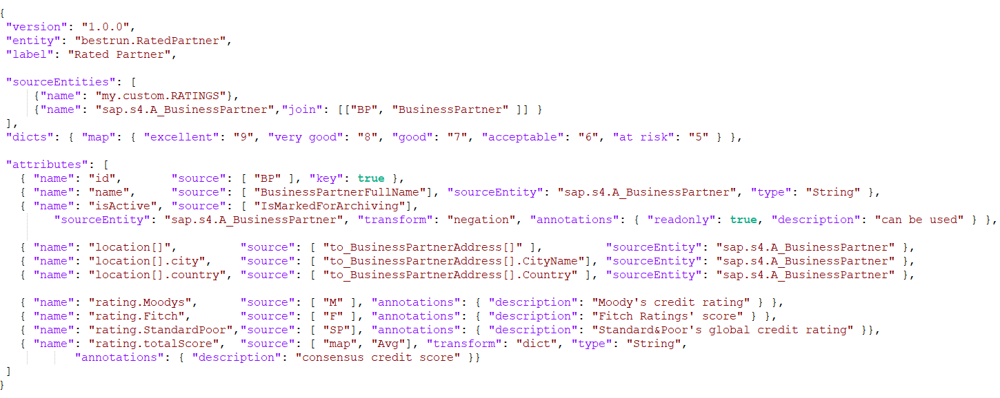

You should be able to understand how this works. We define the new entity `bestrun.RatedPartner`, and the two *source entities* it uses. Then, we define a list of attributes and their derivation from corresponding source attributes, using “*transform*” functions. You can study the detailed specification in the Graph documentation.

This extension specification was already imported, and available as `my-ratedpartner`.

# Let the fun begin

## Step 1 – login to the Integration Suite

If you were given an *odd* user ID number (user01, user03,…, user31, ...), use the following `BLR13` URL:

| [https://teched23`blr13`.integrationsuite.cfapps.ap10.hana.ondemand.com/shell/home](https://teched23blr13.integrationsuite.cfapps.ap10.hana.ondemand.com/shell/home) |
|------------------------------------------------------------------------------------------------------------------------------------------------------------------------|

Users with an *even* user ID numbers (user02, user04, …), use the following `BLR08` URL:

| [https://teched23`blr08`.integrationsuite.cfapps.ap10.hana.ondemand.com/shell/home](https://teched23blr08.integrationsuite.cfapps.ap10.hana.ondemand.com/shell/home) |
|------------------------------------------------------------------------------------------------------------------------------------------------------------------------|

In both cases use `Welcome1` as your password.

## Step 2 – Create a Business Data Graph

Click on the top-left hamburger, so you can see the menu of the SAP Integration Suite on the left.

Then, select `Design => Graph` from the menu.

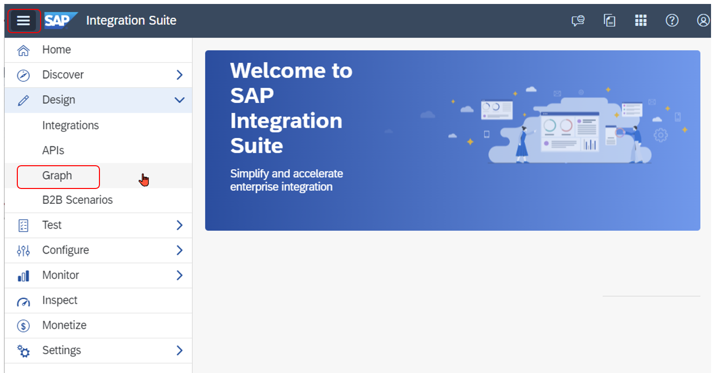

You see the Graph wizard. There may be several data graphs already created by other course participants. Just ignore them.

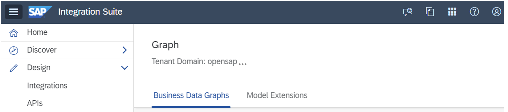

On the `Business Data Graphs` tab, and start the wizard, `Create => New business data graph`.


Enter an ID for the data graph. This name must be unique, and therefore _must_ start with `uNN`, where `NN` is your user id. For instance, if your tenant-user is `user31`, you can name the data graph `u31-rp`.

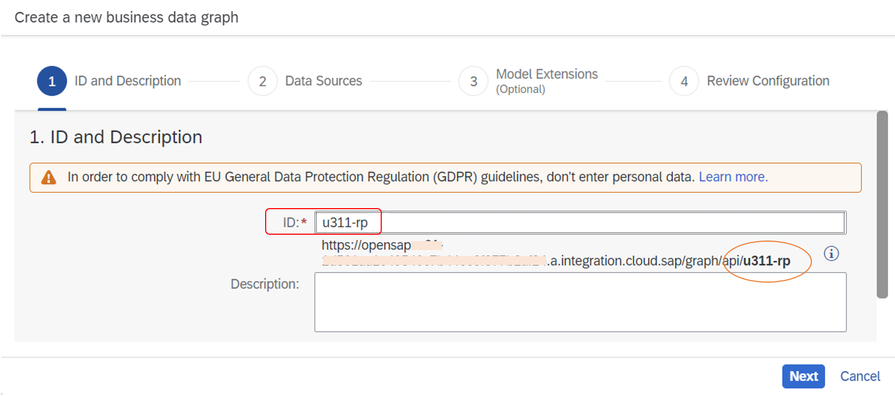

Note the resulting Graph URL. The data graph ID is the last part of this URL.

Click on `Next` and check the two data sources we will use for our data graph.

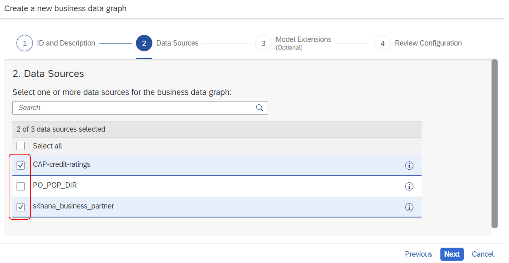

Click `Next` and in the next step select the `my-ratedpartner` model extension. Click `Next` again and wait about 20 seconds. The Graph system is checking your data sources, discovering and connecting entities, and creating a data graph configuration. When complete, you will see the configuration. If you made a mistake, check the logs, cancel, and try again.

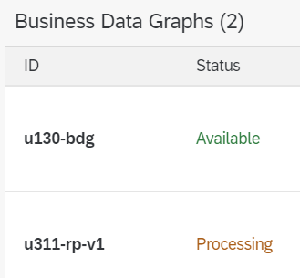

The configuration can be fine-tuned for complex use cases and landscapes, but we just click on `Create` and wait about two minutes, for the system to instantiate and run the data graph. During this time, you will see a status of *Processing*.

When the status turns to “*Available*”, the URL is live, and we are ready to check it out, using the Graph Navigator.

## Step 3 – Use the Graph Navigator

There is little “keypad” on the right of the top-bar. Click it, and then select `Graph Navigator`.

When the Navigator comes up, select the data graph you just created, then select the `bestrun` namespace, and within that the `RatedPartner` entity which we defined. You can see the documented schema and an example.

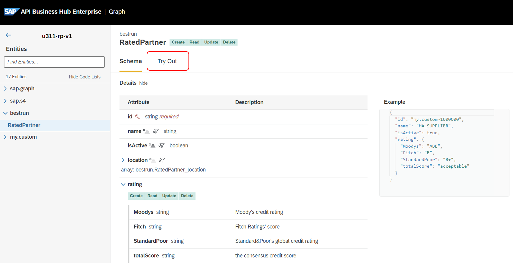

The Graph navigator is connected to live data, the example comes from a real system.

Now, click on the `Try Out` tab, and click `Run` to see how to execute an OData query. By changing the query, you can get powerful results. For instance, you could try the following queries (don’t copy paste – type these in and be impressed by the OData auto-completion feature of the Graph Navigator):

```/bestrun/RatedPartner?$top=10&$expand=location&$select=name,rating```

```/bestrun/RatedPartner?$top=30&$filter=rating/Moodys eq 'AAB'```

Note that the data graph also includes other entities (in other namespaces) in the data graph, and you can still access these other entities, using the same Graph API and URL.

When done, you can close the browser tab.

## Step 4 – Create an API Proxy

As we saw, the Graph API is a powerful abstraction, providing access to the underlying data with one API. But what if we want to really limit our client to *only* use the new `RatedPartner` abstraction?

In the following step, we will add an API Proxy to the Graph API, which will have two purposes: one, it will limit access only to the new RatedPartner URL, and two, it will limit access to only three calls per minute.

You should still be on the Graph page in the SAP Integration Suite (if not, click `Design => Graph`). Find the data graph we just created in the list. Carefully *copy* the URL of that data graph.

From the menu, click `Design => APIs` and then `Create`.

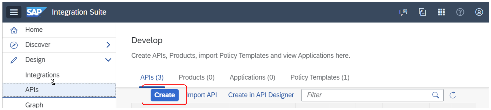

A form pops up.

The form must be filled in as follows:

-   Select the “`URL`” radio button.
-   Paste the data graph URL you just copied in the target URL; then append `/bestrun` to the end of the URL.
-   Name the API proxy. This name must be unique, and therefore `must` start with `uNN`, where `NN` is your tenant user id`.` For instance, if your tenant-user is “user31”, you can name the API proxy `u31-proxy`.
-   Copy the same name into the title and API Base Path fields.
-   Click `Create`.

    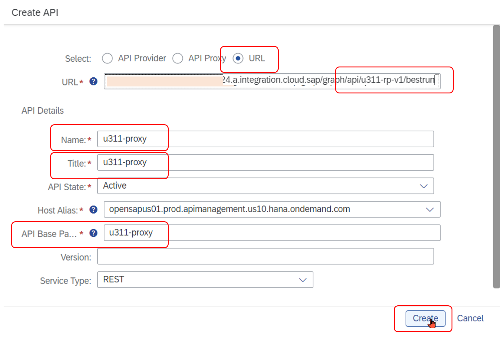

-   Click `Save`.

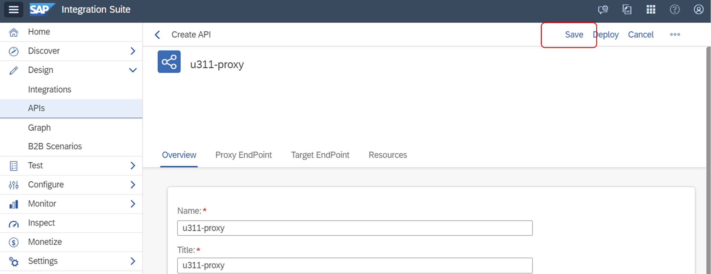

Note the API proxy URL at the top of the screen (including “`prod.apimanagement`”, ending with the API base path that you configured just now. Most customers would actually create a nicer-looking “vanity” URL (e.g., `api.bestrun.com/u31-proxy`) for their API proxy, completely hiding the “internal URLs” behind a firewall. This is beyond this exercise.

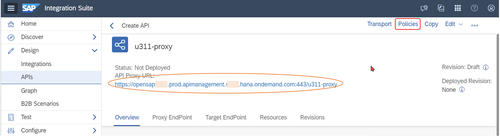

Now let’s add a *quota policy* to our API Proxy. Click on `Policies`, and on `Edit` on the Policy Editor.

Select the `ProxyEndPoint`, and then its `Preflow`. Now, on the right, scroll until you find the `Quota` Policy.

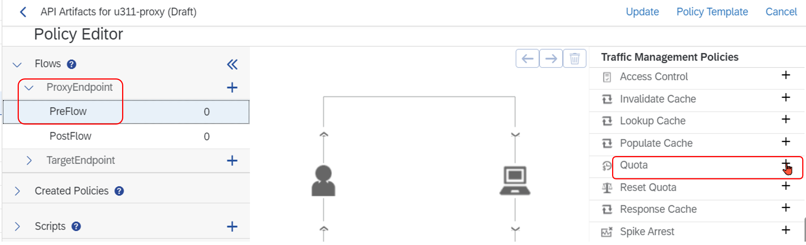

Click on the plus (`+`) and give it a name, e.g. `my-quota`, and press `Add`. This will add the policy to API Proxy.

At the bottom you will find the policy configuration:

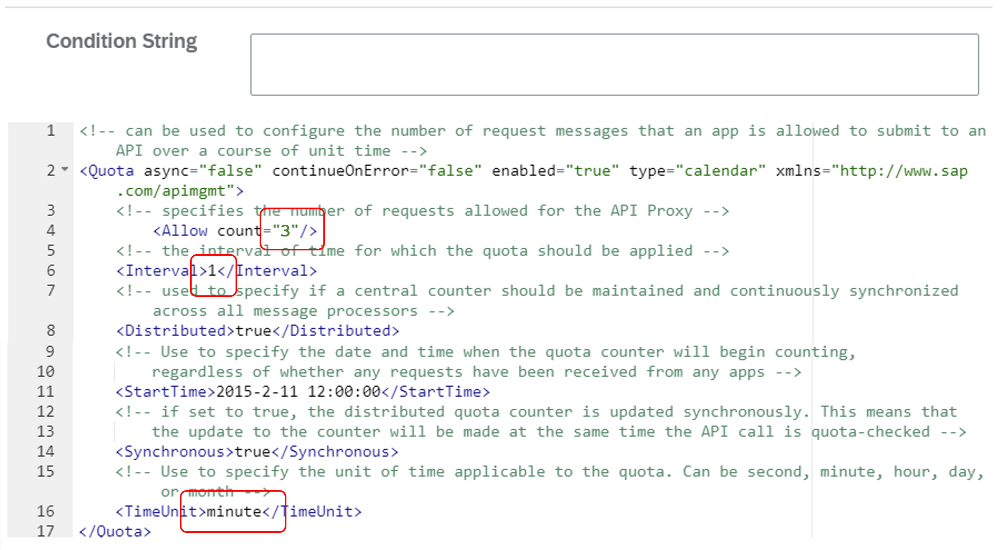

The default policy allows a count of two calls per one (1) minute. Go ahead, change the allow-count to `3`. We will test this later.

Now, click `Update`, and `Save`.

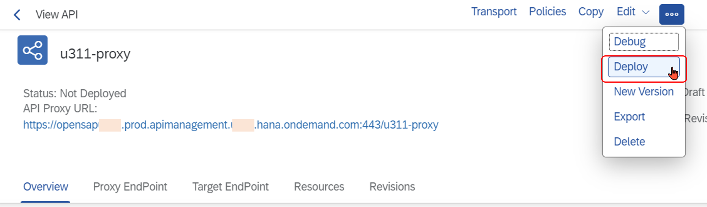

Note that the API proxy is not yet deployed. Select the ellipsis (`…`) on the right, and `Deploy`. Done!

If you now try to click on the API proxy URL (go ahead, try), the call will fail. Why? The API Proxy, by default, *propagates* the identity and authentication credentials from the caller to its target URL, here the data graph. The data graph expects an OAuth 2.0 authentication token, and since we just clicked on a link, this fails.

We will check this out further in the next step. Copy the URL of the API Proxy from the screen.

## Step 5 – Use CURL to test the API Proxy

The API proxy that we just created has no specific authentication policy; the OAuth authentication credentials are simply passed to the data graph. In this step, we will use the “curl” command to obtain an authentication token, and then use that token to make a call to the API.

Open a command terminal on your PC (on Windows, use \<win\> R, and enter `cmd`).

In the terminal that opens, type:

On BLR13 (odd user id):

```curl -X POST <https://teched23blr13.authentication.ap10.hana.ondemand.com/oauth/token> -H "Content-Type:application/x-www-form-urlencoded" -d "grant_type=client_credentials" -d "client_id=sb-90232f75-ebad-47e9-8493-08feb06da7b9!b30456|sap-graph!b24139" -d "client_secret=1c20ad72-12f9-418b-af1f-a8453dac5c24$LXIq-pMUivmjcBYvF_omsogO1KyAM9hTi5nQYEmbEiM="```

On BLR08 (even user id):

```curl -X POST <https://teched23blr08.authentication.ap10.hana.ondemand.com/oauth/token> -H "Content-Type:application/x-www-form-urlencoded" -d "grant_type=client_credentials" -d "client_id=sb-8906f3c8-452d-4215-baf4-29ed89d16df1!b28124|sap-graph!b24139" -d "client_secret=4cc39d9d-5e98-4164-954d-6b2cc0326249$iZEnuNDvCpX0yeP86SzyA-BnudBdudzFiopbkJzXYzs="```

If all goes well, you will see a response with an access token.

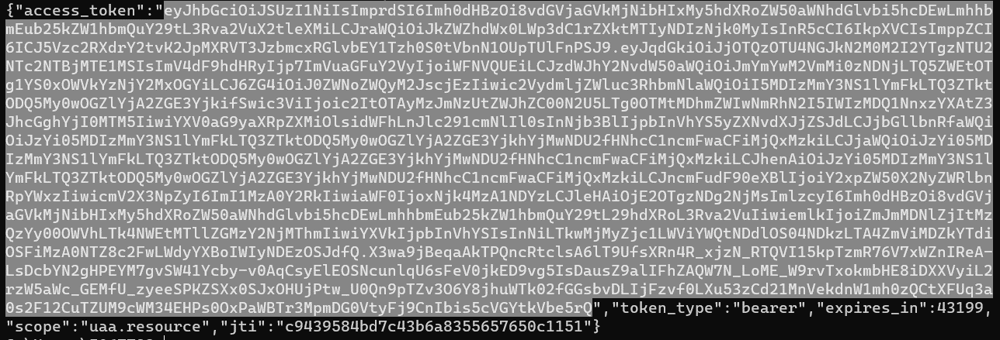

Carefully select and copy the string.

We will also need the URL of the API proxy. But remember, that is the URL of the `bestrun` namespace. You need to append an entity query, for example, `/RatedPartner?$top=1` to that URL.

So, now that we have a token and URL, enter the following curl command,

```curl -X GET <url> -H "Authorization: Bearer <access-token>"```

and substitute \<url\> with the URL of the API proxy with the entity query, and substitute \<access-token\> with the access token you just copied:

```curl -X GET https://teched23blr.../RatedPartner?$top=1` -H "Authorization: Bearer eyJh...Q"```

The response should look like this:

`{"@odata.context":"$metadata#RatedPartner","value":[{"id":"my.custom~1000000","name":"HA_SUPPLIER","isActive":true,"rating":{"Moodys":"ABB","Fitch":"B","StandardPoor":"B+","totalScore":"acceptable"}}]}`

Repeat this last command a few times. What happens? Cool, no?

## Step 6 – Add an OAuth policy template

What if we want to enable “anonymous” and unauthenticated (but still carefully controlled) access to our data graph, which still expects an OAuth 2.0 token?

For this, we will learn how to use a *Policy Template,* called “`Cloud_Platform_Connectivity`”. You can find this policy template, and many, many more on the SAP Business Accelerator Hub. The documentation for the template we are using can be found here: <https://hub.sap.com/policytemplate/Cloud_Platform_Connectivity>.

Go back to `Design => APIs` in the SAP Integration Suite application.

Select your API proxy from the list of APIs. At the top, click `Policies` and on the Policy Editor, click `Edit`.

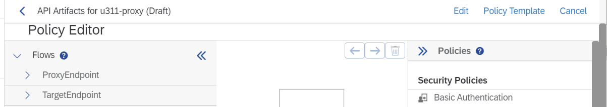

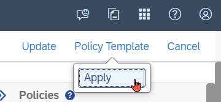

Click on `Policy Template => Apply` in the top corner.

Check the `Cloud_Platform_Connectivity` template and `Apply`.

The policies from the template now appear in the “picture” under the `TargetEndPoint`.

We now need to insert the client ID and client secret in the `getcredential` policy, and the URL used to grant a token, in the `getoauthtoken` policy. Start with the the `getcredential` policy. Select this policy in the picture. The configuration is at the bottom of the screen.

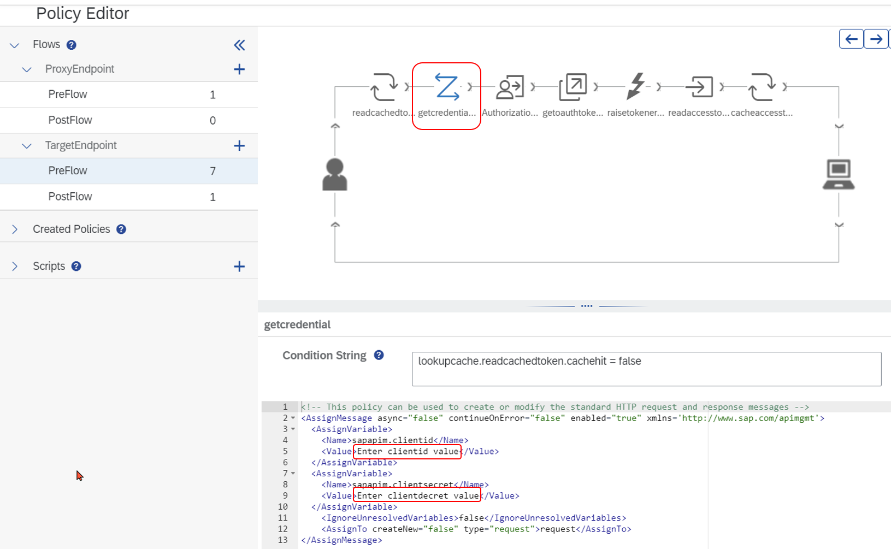

**BLR13 OAuth credentials (odd user Id)**

| Client id                                 | sb-90232f75-ebad-47e9-8493-08feb06da7b9!b30456|sap-graph!b24139                   |
|---------------|------------------------------------------------------------------------------------|
| Client secret                             | 1c20ad72-12f9-418b-af1f-a8453dac5c24$LXIq-pMUivmjcBYvF_omsogO1KyAM9hTi5nQYEmbEiM= |

**BLR08 OAuth credentials (even user ids)**

| Client id     | sb-8906f3c8-452d-4215-baf4-29ed89d16df1!b28124|sap-graph!b24139                   |
|---------------|------------------------------------------------------------------------------------|
| Client secret | 4cc39d9d-5e98-4164-954d-6b2cc0326249$iZEnuNDvCpX0yeP86SzyA-BnudBdudzFiopbkJzXYzs= |

Then select the `getoauthtoken` policy. Change the access token URL as follows:

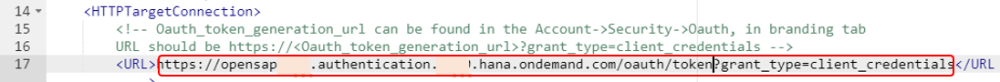


| BLR13 | https://teched23blr13.authentication.ap10.hana.ondemand.com/oauth/token/oauth/token?grant_type=client_credentials |
|-------|----------------------------------------------------------------------------------------------------------------------------------------------------------------------------------|
| BLR08 | https://teched23blr08.authentication.ap10.hana.ondemand.com/oauth/token?grant_type=client_credentials                                                                            |

Ok. We are almost done… Click `Update`, then `Save`, and then `Click to Deploy` and `Yes` to deploy the changes.

Now, enter the URL of the API proxy in a browser tab (remember? You can find the URL in the list of API proxies). Remember to append, for example, `/RatedPartner?$top=3,` in order to see a bit of data.

With the additional policies from the policy template, the API proxy now handles the OAuth protocol on behalf of the caller, and the data graph is available for “anonymous” usage.

Refresh the page. After 2 or 3 times (depending on how you configured the quota policy), access will be denied.

## Step 7 – Publish the URL

What is an API good for, if developers don’t know about it?

In this step, we will create an API grouping, called a *Product*, and then *publish* the group of APIs to the API Business Hub Enterprise (ABHE), where developers with be able to learn about the API.

From the menu, click `Design => APIs`, click on the `Products` tab and then `Create`. Give the product a unique name, like `u31-myproduct`:

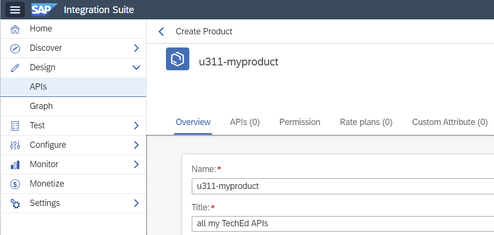

To publish a product, it has to have APIs. Click on the APIs tab, then `Add`. Find the API that we created in the first step and click `OK`.

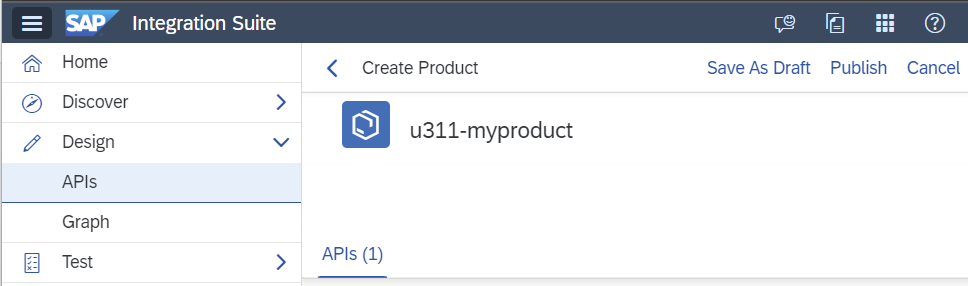

Click on `Publish`. You may see other Products, published by other participants.

## Step 8 – the developer portal: API Business Hub Enterprise

Enter the developer portal, called `API Business Hub Enterprise`, from the little keypad menu on the right:

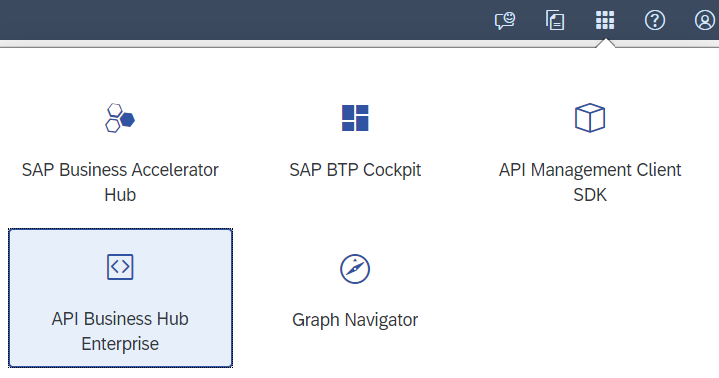

As an administrator, you can manage how developers access information on this portal. Most customers will provide developers self-service access, so they can explore the APIs and obtain the necessary credentials. You can also generate credentials yourself, and selectively hand these to your developers, which is what we will do today.

Now click on a product tile, and then `Subscribe, => Create New Application`:

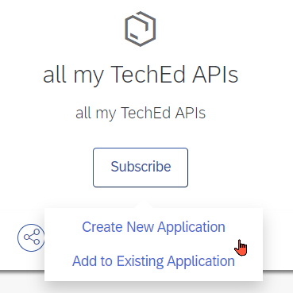

Provide a title, and check `Create this application on behalf of someone else`. Select one of the registered developers for whom you are generating the credentials, from the dropdown:

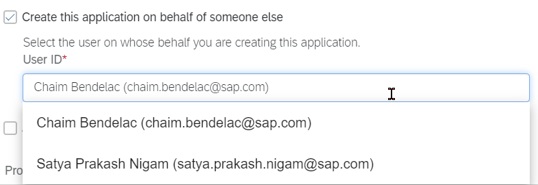

And, finally, add the product that we just created in step 7, by clicking on the `+` box:

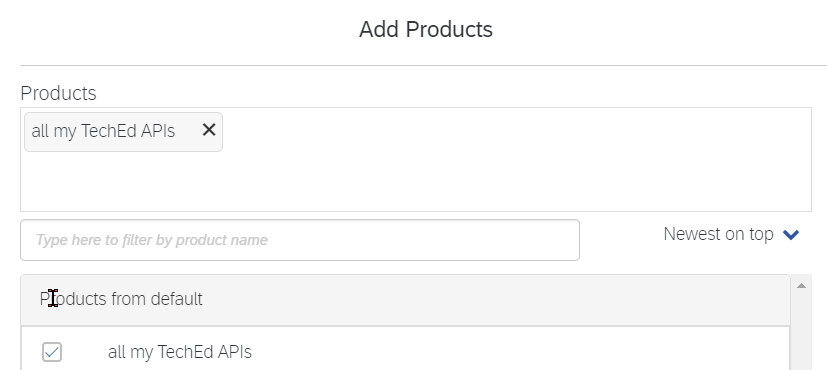

And click `OK` and then `Save`.

You can now hand the generated credentials to the developer, who can use them to build a new application.

## Bonus step – customize the developer portal

You will have noticed that there is a “New Design” feature, at the top of the page. As an administrator of the API Business Hub Enterprise, you can turn this on and *customize* the look and feel of the developer portal.

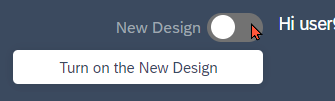

As a bonus for reaching the end of this exercise, feel free to switch to the new design, and experiment changing the look and feel of the developer portal. Keep in mind that these changes are going to affect all other participants, and their changes may surprisingly affect yours.

*That‘s it! You made it to the end!*

`Enjoy the rest of TechEd!`
